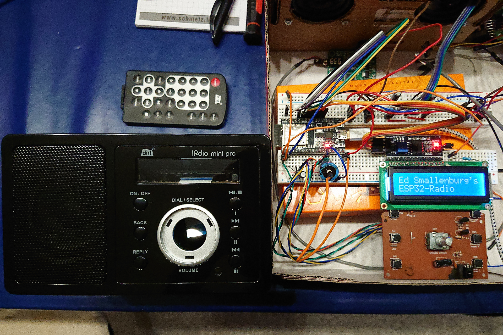

# ESP32Radio-V2
This fork tries to revive a "DNT IPDio Mini Pro".
Using the original Frontpanel 1602LCD with an I2C backpack.
Buttons on the frontpanel are wired like a Matrix Keypad including the Rotary switch

!!! IO Pinning is different to the standard ESP32Radio-V2 !!!

- 2022-05-15 Use Ed's actual code and get the display and the IR-Eye working again
- 2022-05-19 Get input from the keypad and link to the rotary switch functions
- 2022-05-22 Send commands with the keypad / Enable "Stop/Resume" function again in a basic way
- 2022-05-31 Modified "tftlog" to show startup messages on the 1602LCD, Changes in "spfuncs" and "dsp_update" to get that working

--------------------------------------------------------------------------------------

New version of the well known ESP32 Radio.  Now optional I2S output!
- Compile time configuration in config.h.
- Do not forget to upload the data directory to the ESP32.
- SD cards supported, but still experimental.

Updates: 
- 05-oct-2021: Fixed internal DAC output, fixed OTA upload.
- 06-oct-2021: Fixed AP mode.
- 26-mar-2022: Fixed NEXTION bug.
- 12-apr-2022: Fixed queue bug (NEXT function).
- 13-apr-2022: Fixed redirect bug (preset was reset), fixed playlist bug.
- 14-apr-2022: Add FIXEDWIFI in config.h to simplify WiFi set-up.
- 15-apr-2022: Redesigned station selection.
- 25-apr-2022: Add support for WT32-ETH0 (wired Ethernet).
- 04-may-2022: OLED with Wire library, should work with Heltec-WIfi board.
